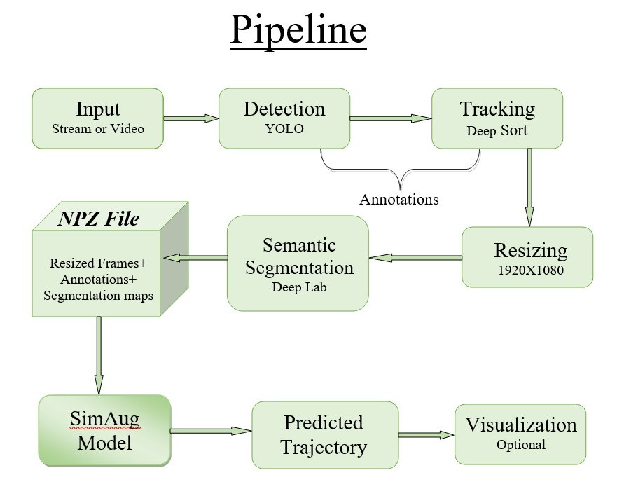

# Pedestrian Trajectory Prediction
Predicting future trajectories of people in cameras of novel scenarios and views.

## This repository contains the code and models for the following ECCV'20 paper:

[ SimAug: Learning Robust Representatios from Simulation for Trajectory Prediction ](https://arxiv.org/abs/2004.02022)
Junwei Liang, Lu Jiang, Alexander Hauptmann

## Our Pipline


## References
```
@inproceedings{liang2020simaug,
  title={SimAug: Learning Robust Representations from Simulation for Trajectory Prediction},
  author={Liang, Junwei and Jiang, Lu and Hauptmann, Alexander},
  booktitle={Proceedings of the European Conference on Computer Vision (ECCV)},
  month = {August},
  year={2020}
}
```

