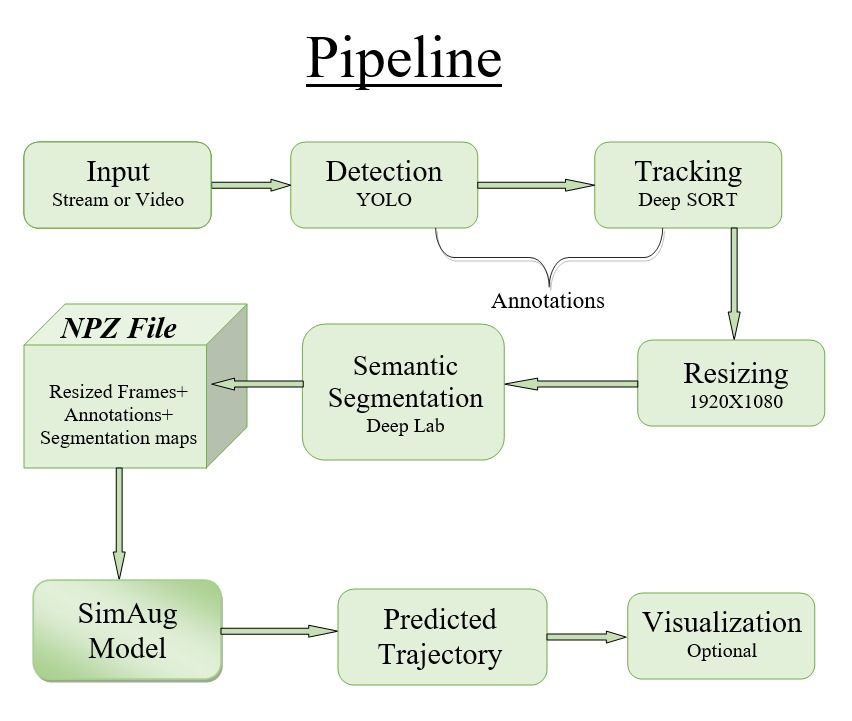

# Pedestrian Trajectory Prediction
Predicting future trajectories of pedestrians in cameras of novel scenarios and views.

## This repository contains the code and models for the following ECCV'20 paper:

[ SimAug: Learning Robust Representatios from Simulation for Trajectory Prediction ](https://arxiv.org/abs/2004.02022)
Junwei Liang, Lu Jiang, Alexander Hauptmann

## Our Pipeline

<p align="center">
  
</p>

•	**Input**: could be from a streaming camera or saved videos.

•	**Detection**: we used a pre-trained model called **YOLO** (You Only Look Once) to perform object detection, it uses convolutional neural networks to provide real-time object detection, it is popular for its speed and accuracy.

•	**Tracking**: we used a pre-trained model called **Deep SORT** (Simple Online and Realtime Tracking), it uses deep learning to perform object tracking in videos. It works by computing deep features for every bounding box and using the similarity between deep features to also factor into the tracking logic. It is known to work perfectly with YOLO and also popular for its speed and accuracy.

•	**Resizing**: at this step, we get the frames and resize them to the required shape which is 1920 X 1080.

•	**Semantic Segmentation**: we used a pre-trained model called **Deep Lab** (Deep Labeling) an algorithm made by Google, to perform the semantic segmentation task, this model works by assigning a predicted value for each pixel in an image or video with the help of deep neural network support. It performs a pixel-wise classification where each pixel is labeled by predicted value encoding its semantic class.

•	**SimAug Model**: Simulation as Augmentation, is a novel simulation data augmentation method for trajectory prediction. It augments the representation such that it is robust to the variances in semantic scenes and camera views, it predicts the trajectory in unseen camera views.

•	**Predicted Trajectory**: The output of the proposed pipeline.


# Code
####  Fisrt you need to install packages according to the configuration file:
```
$ pip install -r requirements.txt
```

### Running on video
#### Then download the deeplab ADE20k model(used for Semantic Segmentation):
```
$ wget http://download.tensorflow.org/models/deeplabv3_xception_ade20k_train_2018_05_29.tar.gz
$ tar -zxvf deeplabv3_xception_ade20k_train_2018_05_29.tar.gz
```

#### Then download SimAug-trained model:
```
$ wget https://next.cs.cmu.edu/data/packed_models_eccv2020.tgz
$ tar -zxvf packed_models_eccv2020.tgz
```
#### Run the pretrained YOLOv5 & DEEPSORT
get the annotations on a sample video [**many_people.mp4**](https://github.com/Moaz-ALhady-Fathy/trajectory_prediction/blob/main/videos/Many%20People.mp4) from yolo and deepsort + resized images to 1920 x 1080

```
dataset_resize,changelst , annotation = detect('many_people.mp4')
```
#### Prepare the annotation
- get box centre x,y for each person (traj_data)
- person_box_data : boxes coordinates for all persons
- other_box_data : boxes of other objects in the same frame with each targeted person

```
traj_data, person_box_data, other_box_data  = prepared_data_sdd(annotation,changelst)
```
#### Run the segmentation model

```
model_path= 'deeplabv3_xception_ade20k_train/frozen_inference_graph.pb'
seg_output= extract_scene_seg(dataset_resize,model_path,every =100)
```
#### Prepare all data for the SimAug model
###### making npz which contanins arrays for details of the segmentation with annotations and person ids

```
data=To_npz(8,12,traj_data,seg_output)
np.savez("prepro_fold1/data_test.npz", **data)
```
#### Test SimAug-Trained Model

```
!python Code/test.py prepro_fold1/ packed_models/ best_simaug_model \
--wd 0.001 --runId 0 --obs_len 8 --pred_len 12 --emb_size 32 --enc_hidden_size 256 \
--dec_hidden_size 256 --activation_func tanh --keep_prob 1.0 --num_epochs 30 \
--batch_size 12 --init_lr 0.3 --use_gnn --learning_rate_decay 0.95 --num_epoch_per_decay 5.0 \
--grid_loss_weight 1.0 --grid_reg_loss_weight 0.5 --save_period 3000 \
--scene_h 36 --scene_w 64 --scene_conv_kernel 3 --scene_conv_dim 64 \
--scene_grid_strides 2,4 --use_grids 1,0 --val_grid_num 0 --gpuid 0 --load_best \
--save_output sdd_out.p
```
##### To Run the pipeline from [here](https://github.com/Moaz-ALhady-Fathy/trajectory_prediction/blob/main/pipeline.ipynb)

## Demo

https://user-images.githubusercontent.com/62403347/148702150-4044d05e-ea69-4dc8-bef4-c0e1481e165f.mp4

## Results
We capture streaming video that contains 1628 frames, processing time for stages is

   • Yolo & Deep SORT: 20.7 f/s 
   
   • DeepLabv3:  4.66 f/s 
   
   • SimAug: 12.8 f/s 
   

|   Video_Name  |   Grid_acc    |     minADE    |     minFDE    |
| ------------- | ------------- | ------------- | ------------- |
|   Moving-ITI  |    0.6098     |     22.132    |     39.271    |

## Dependencies
•	Python 3.6 ; TensorFlow 1.15.0 ; Pytorch 1.7 ; Cuda 10


## Code Contributors
<a href="https://github.com/Moaz-ALhady-Fathy/trajectory_prediction/graphs/contributors">
  
</a>

## References
```
@inproceedings{liang2020simaug,
  title={SimAug: Learning Robust Representations from Simulation for Trajectory Prediction},
  author={Liang, Junwei and Jiang, Lu and Hauptmann, Alexander},
  booktitle={Proceedings of the European Conference on Computer Vision (ECCV)},
  month = {August},
  year={2020}
}
```
